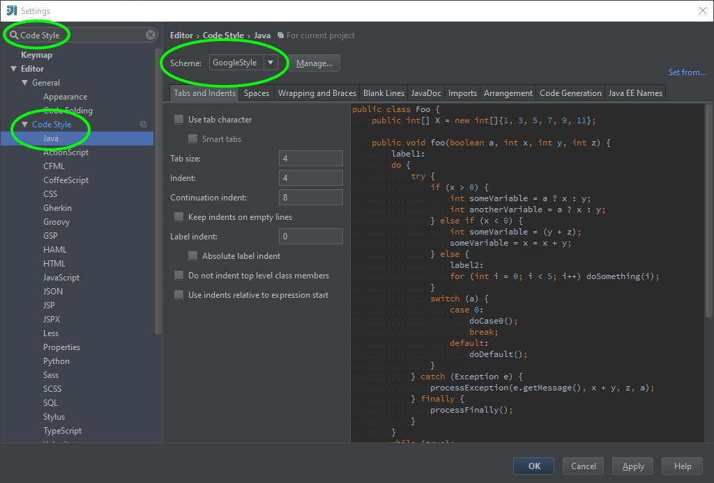

# Install the Google Java code style in IntelliJ
1. Download the intellij-java-google-style.xml file from the http://code.google.com/p/google-styleguide/ repository.
2. Make the config/codestyles folder in your IntelliJ settings directory and copy the XML file into it.
3. Search Code Style in Settings of IntelliJ and select Java, change the schema to GoogleStyle and save it.

###Note: 
* [Google Java Style](http://google.github.io/styleguide/javaguide.html) 
* [Directory Used by IntelliJ IDEA to Store Settings](https://www.jetbrains.com/idea/help/directories-used-by-intellij-idea-to-store-settings-caches-plugins-and-logs.html)

